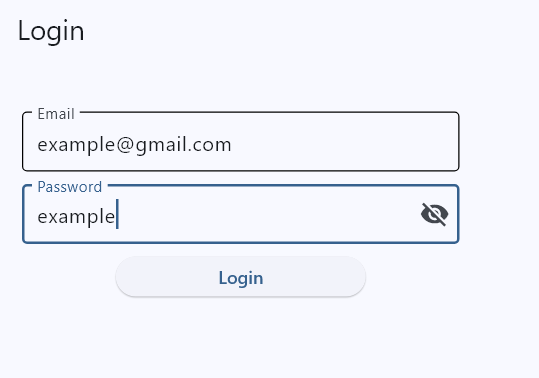
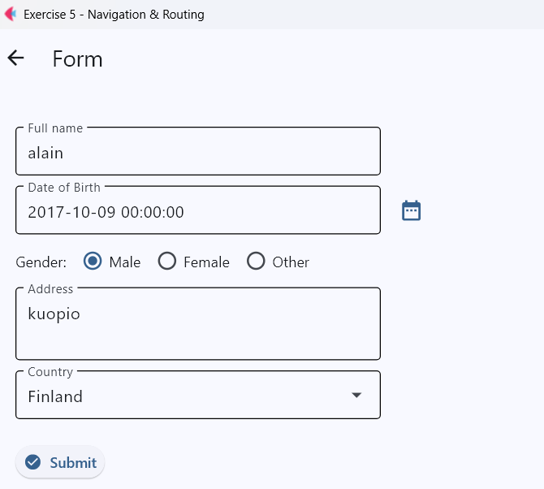
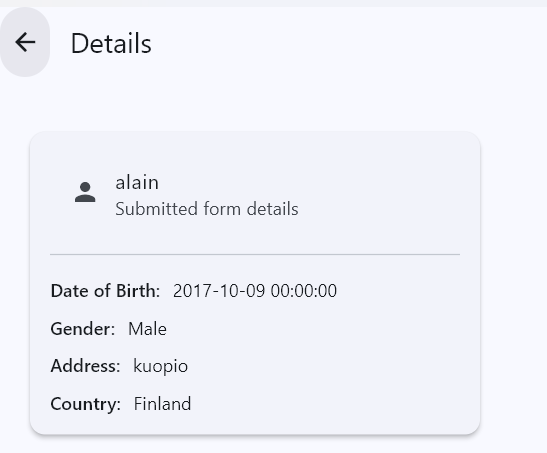

# Exercise5_navigation_and_routing
Exercise 5 from User Interface Programing class.

## App overview
- Pages: Login → Home → Form → Details
- App bar back navigation on Home, Form, and Details
- Login validation: shows error when email or password is empty
- Home: button to navigate to Form
- Form: name, date of birth (DatePicker), gender (RadioGroup), address (multiline), country (Dropdown)
- Details: shows submitted data inside a Flet Card

## Output from the code:
   

   

   